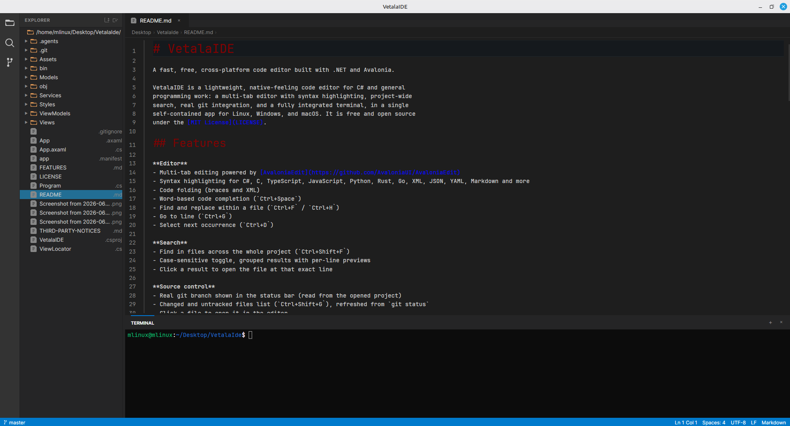

# Vetala

A fast, free, cross-platform code editor built with .NET and Avalonia.

Vetala is a lightweight, native-feeling code editor for C# and general
programming work: a multi-tab editor with syntax highlighting, project-wide
search, real git integration, and a fully integrated terminal, in a single
self-contained app for Linux, Windows, and macOS. It is free and open source
under the [MIT License](LICENSE).



## Features

**Editor**
- Multi-tab editing powered by [AvaloniaEdit](https://github.com/AvaloniaUI/AvaloniaEdit)
- Syntax highlighting for C#, C, TypeScript, JavaScript, Python, Rust, Go, XML, JSON, YAML, Markdown and more
- Code folding (braces and XML)
- Word-based code completion (`Ctrl+Space`)
- Find and replace within a file (`Ctrl+F` / `Ctrl+H`)
- Go to line (`Ctrl+G`)
- Select next occurrence (`Ctrl+D`)

**Search**
- Find in files across the whole project (`Ctrl+Shift+F`)
- Case-sensitive toggle, grouped results with per-line previews
- Click a result to open the file at that exact line

**Source control**
- Real git branch shown in the status bar (read from the opened project)
- Changed and untracked files list (`Ctrl+Shift+G`), refreshed from `git status`
- Click a file to open it in the editor

**Project**
- File explorer with create / rename / delete / duplicate for files and folders
- Quick Open by file name (`Ctrl+P`)
- Command palette (`Ctrl+Shift+P`) and quick actions menu (`Ctrl+K`)

**Terminal**
- Fully integrated terminal (bash / zsh / cmd.exe via a real PTY)
- ANSI color and 256-color support, resize-aware, command history

## Requirements

- [.NET 10 SDK](https://dotnet.microsoft.com/download/dotnet/10.0)
- `git` on your PATH (optional, only used by the source control panel)
- Linux, Windows, or macOS

## Getting started

```bash
git clone <repository-url>
cd Vetala
dotnet run
```

To build a release binary for your platform:

```bash
dotnet publish -c Release -r linux-x64   # or win-x64 / osx-x64 / osx-arm64
```

## Keyboard shortcuts

| Shortcut | Action |
|----------|--------|
| `Ctrl+S` / `Ctrl+Shift+S` | Save / save all |
| `Ctrl+W` | Close tab |
| `Ctrl+P` | Quick Open (search files by name) |
| `Ctrl+Shift+P` | Command palette |
| `Ctrl+K` | Quick actions menu |
| `Ctrl+B` | Toggle explorer |
| `Ctrl+Shift+F` | Find in files |
| `Ctrl+Shift+G` | Toggle source control |
| `Ctrl+F` / `Ctrl+H` | Find / replace in file |
| `Ctrl+G` | Go to line |
| `Ctrl+Space` | Code completion |
| `Ctrl+D` | Select next occurrence |

See [FEATURES.md](FEATURES.md) for the complete reference.

## Project structure

```
Vetala/
├── Assets/           # Icons, fonts, images
├── Controls/         # Custom editor controls
├── Models/           # Data models (tabs, file tree, search and git entries)
├── Services/         # Business logic (files, search, git, terminal, dialogs)
├── ViewModels/       # MVVM view models (main window, editor, sidebar, search, git)
├── Views/            # XAML views and code-behind
│   ├── Pages/        # Welcome and licenses pages
│   ├── Panels/       # Editor, sidebar, search, source control, terminal
│   └── Dialogs/      # Permission and input dialogs
└── Styles/           # Design system (VS Code Dark+ theme)
```

## Tech stack

- **Language:** C# (.NET 10)
- **UI framework:** Avalonia UI 12
- **Editor:** AvaloniaEdit 12
- **MVVM:** CommunityToolkit.Mvvm 8
- **Terminal:** Porta.Pty (forkpty on Unix, ConPTY on Windows)

## Roadmap

- C# language tooling via the Language Server Protocol (OmniSharp-based
  completion, diagnostics, go-to-definition)

## License

Released under the [MIT License](LICENSE). Third-party attributions are in
[THIRD-PARTY-NOTICES.md](THIRD-PARTY-NOTICES.md).
